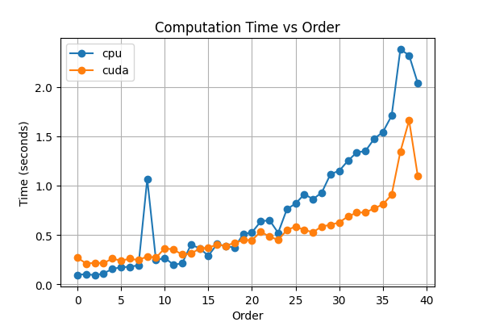
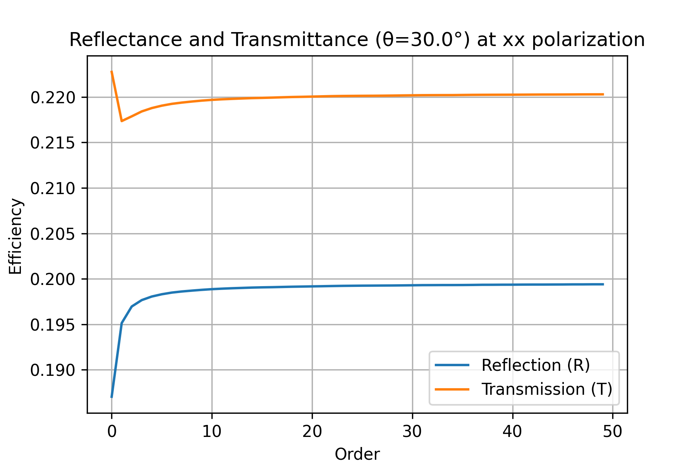
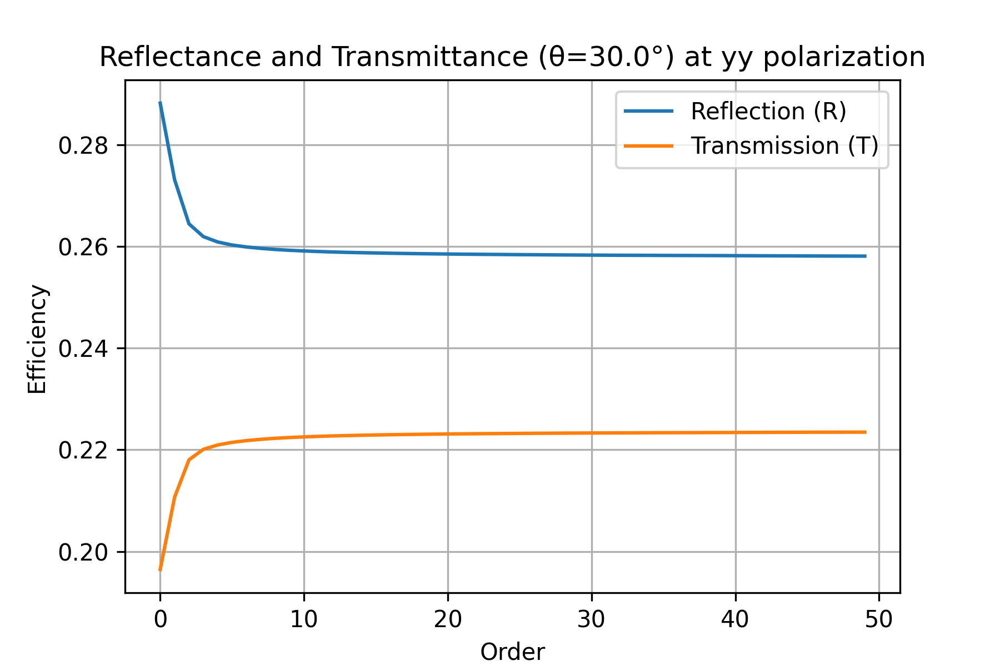
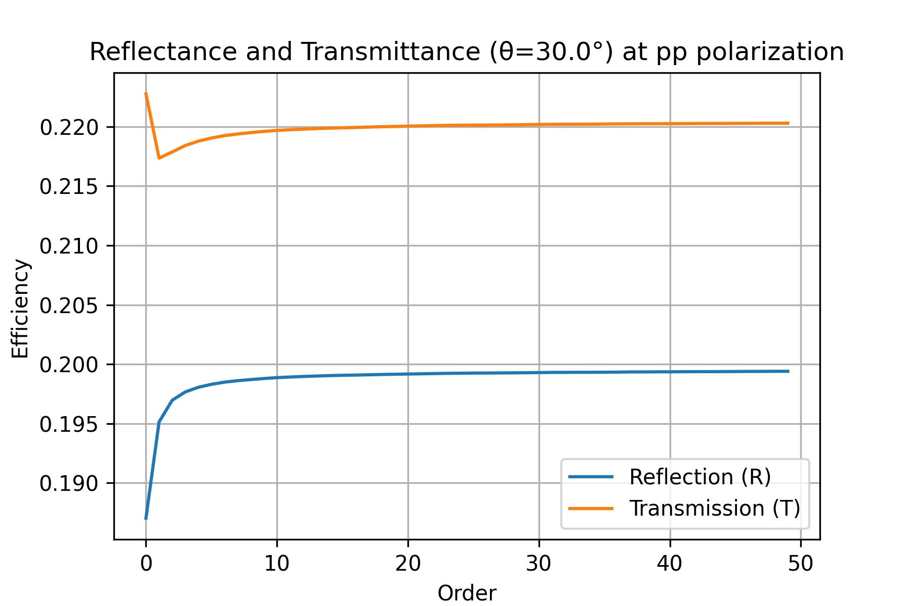

# SinTiN Torcwa

Simulation of the optical response of diffractive structures using TORCWA.

Here the structure is a sine grating of TiN on a SiO2 substrate.

## Eval orders :

Here only need to set y order as this is a 1D grating

