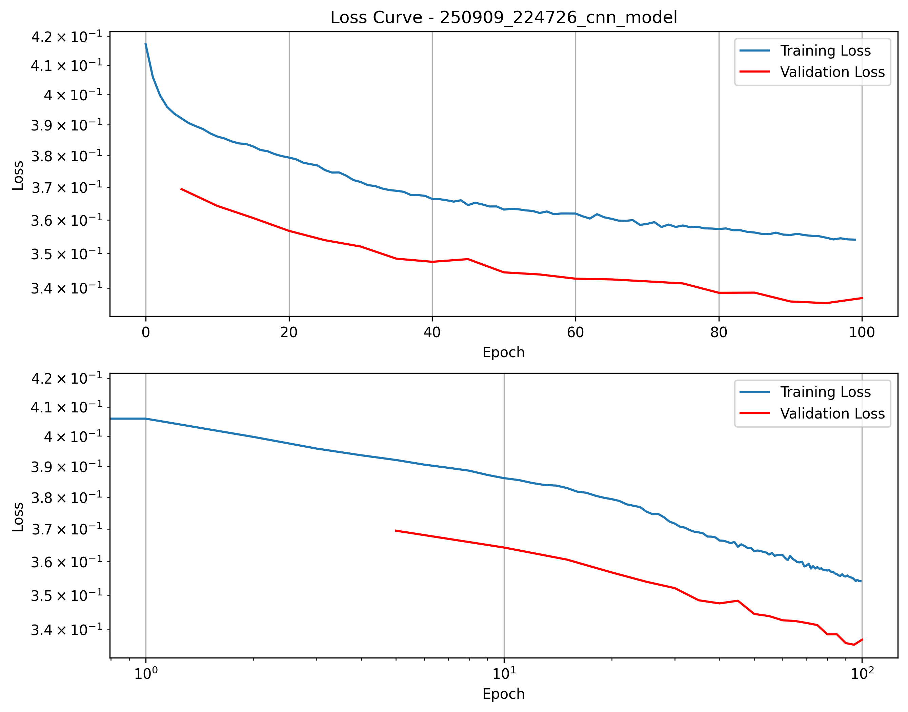

# v1: HyperNet wavelength-angle-fields to fields prediction

## Description
Here the goal is to predict the EM fields in and around a 1D sine TiN structure given the wavelength, angle and incident EM fields above it. The incident fields are generated by a point source located above the structure.

## Dataset
The dataset is generated using TORCWA, it contains 900 samples:
Range of parameters:
- Wavelength: 400nm - 2000nm
- Angle of incidence: 0 - 70 degrees

Fields are initially sampled on a 2D grid of size 256x500 (x,z).

## Model
The model is a HyperNet that takes as input the wavelength, angle and returns the weights of a CNN that takes as input the incident fields and returns the fields in and around the structure.

